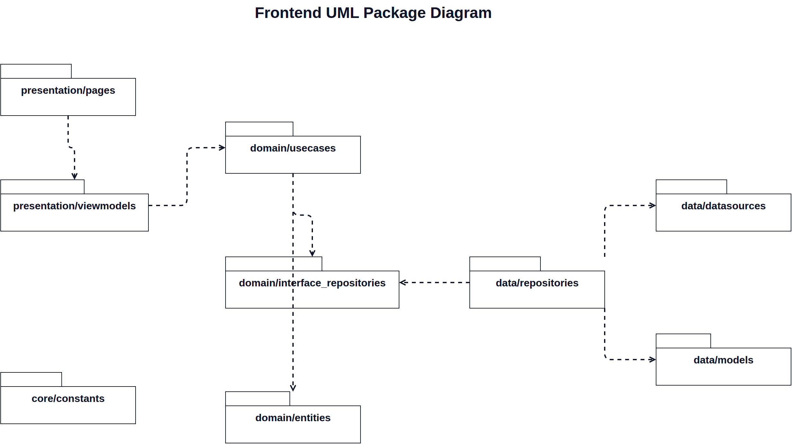

# Package Diagram

This document lists the package folders under `lib` and shows only dependency relationships between them.

## Packages

| Package | Purpose |
| --- | --- |
| `presentation/pages` | Screen-level UI. |
| `presentation/viewmodels` | UI state and actions for pages. |
| `domain/usecases` | Application actions and business workflows. |
| `domain/interface_repositories` | Repository contracts used by domain logic. |
| `domain/entities` | Core business objects. |
| `data/repositories` | Repository implementations. |
| `data/datasources` | External API or local storage access. |
| `data/models` | Data transfer objects and serialization models. |
| `core/constants` | Shared constants used across packages. |

## Dependency Relationships

| From | Depends On |
| --- | --- |
| `presentation/pages` | `presentation/viewmodels` |
| `presentation/viewmodels` | `domain/usecases` |
| `domain/usecases` | `domain/interface_repositories` |
| `domain/usecases` | `domain/entities` |
| `data/repositories` | `domain/interface_repositories` |
| `data/repositories` | `data/datasources` |
| `data/repositories` | `data/models` |
| `core/constants` | Shared package available to all layers when constants are needed. |

Editable source: `docs/diagrams/package-diagrams.drawio`

Rendered image: `docs/diagrams/package-diagrams.png`
